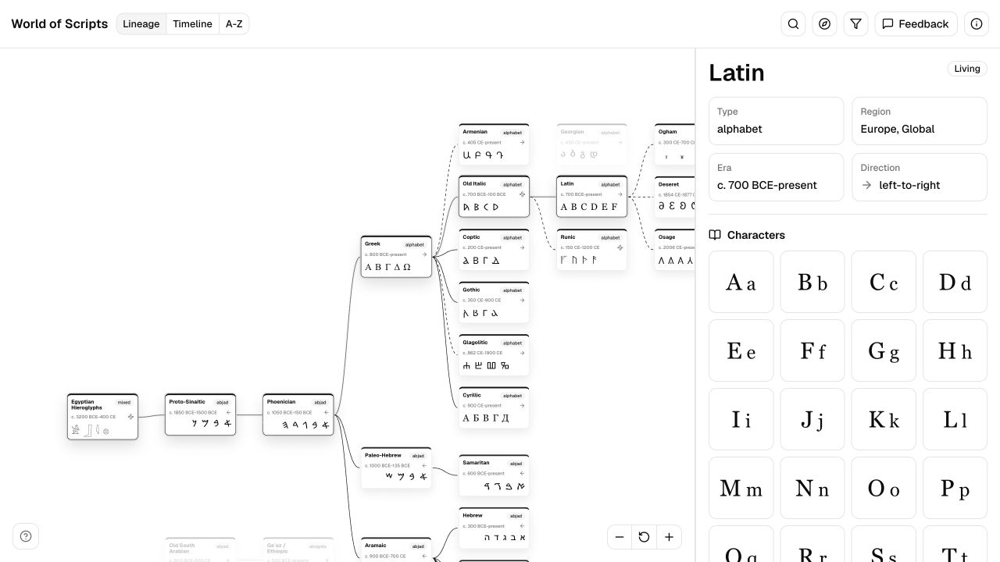
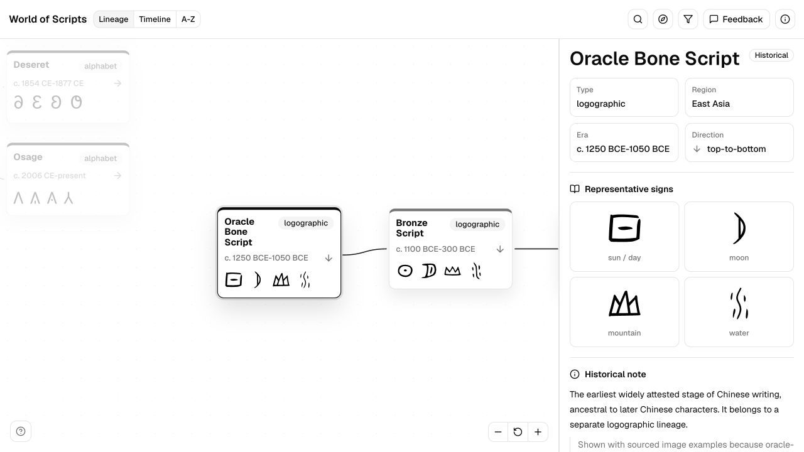

<p align="center">
  
</p>

# World of Scripts

World of Scripts is an interactive web app for exploring writing systems, their histories, and their documented relationships.

The main view is a zoomable family-tree style diagram. Select a script node to see its characters or representative signs, date range, region, writing direction, historical notes, and direct lineage links.

## Screenshots





## Features

- Interactive lineage diagram for major writing systems.
- Search, filters, and guided traces for important script families.
- Inspector panel with character grids, examples, metadata, notes, and sources.
- Direction icons for left-to-right, right-to-left, vertical, bottom-to-top, and mixed writing behavior.
- Curated relationship edges: lines are only shown where the relationship is sourced.
- SVG glyph samples for scripts where plain Unicode text is incomplete or misleading.

## References

This project draws on public references including:

- [Wikipedia: Alphabet](https://en.wikipedia.org/wiki/Alphabet)
- [World Writing Systems](https://www.worldswritingsystems.org/)

Relationship data is curated conservatively. A missing line does not mean two scripts are unrelated; it means the app is not currently showing a sourced direct relationship.

## Development

Install dependencies:

```sh
npm install
```

Run the development server:

```sh
npm run dev
```

Build for production:

```sh
npm run build
```

Validate the script dataset:

```sh
npm run validate:content
```

## Feedback

Report corrections, missing scripts, source issues, or UI problems in [GitHub Issues](https://github.com/sichengchen/world-of-scripts/issues).
